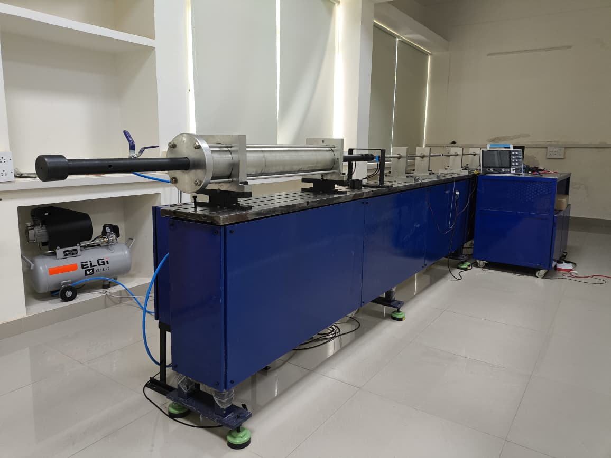
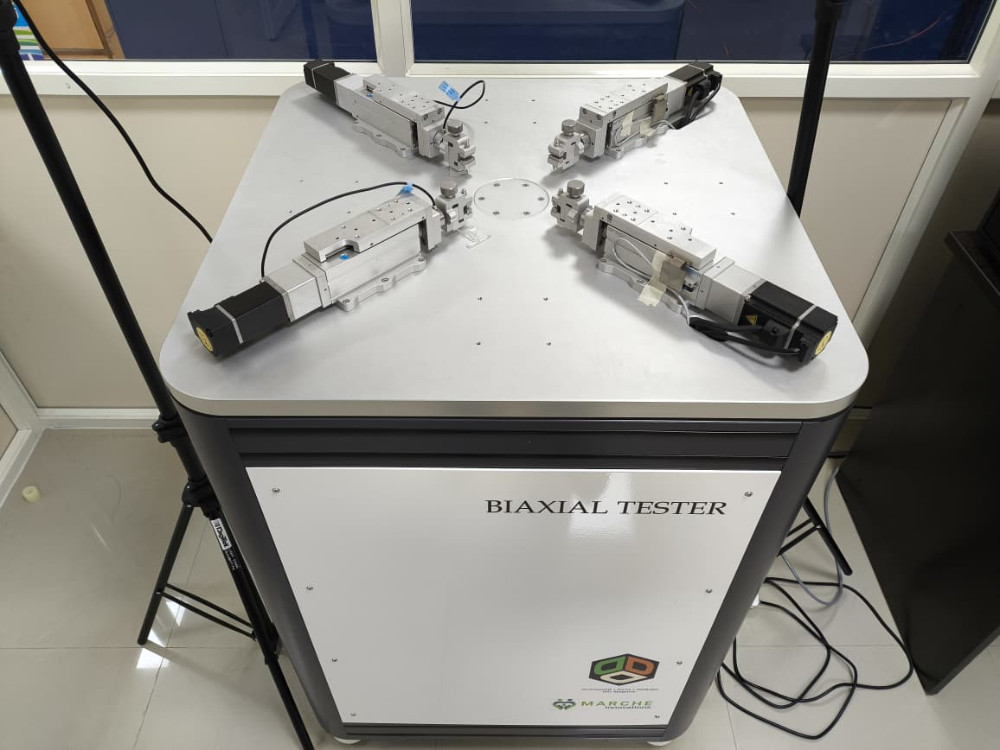
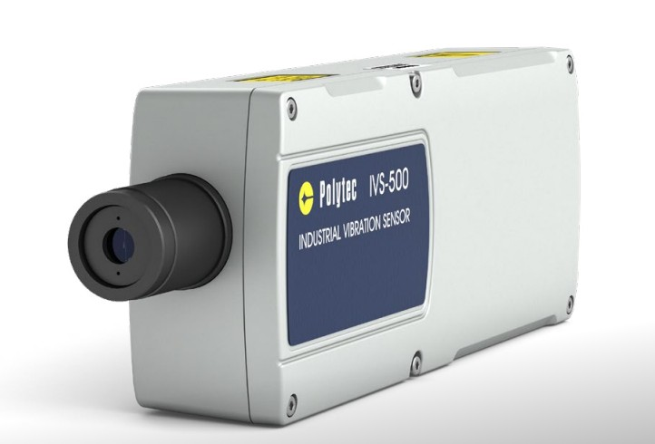
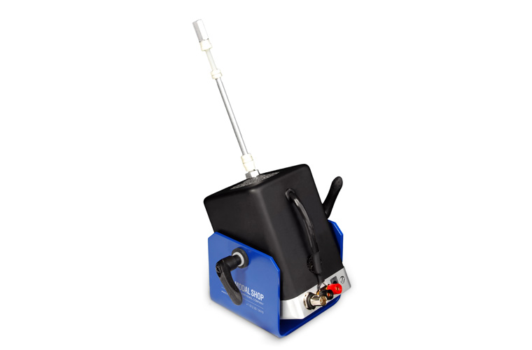

Our laboratory is equipped with a range of experimental and measurement systems for high strain-rate testing, multiaxial deformation studies, and structural dynamics measurements. These facilities support our work in material characterization, wave propagation, inverse modeling, and data-driven constitutive discovery.



## 1. Split-Hopkinson Pressure Bar

The Split-Hopkinson Pressure Bar (SHPB) setup is used for characterizing materials under high strain-rate loading conditions. It enables dynamic testing by generating stress waves through elastic bars and measuring the resulting specimen response. The setup is useful for studying rate-dependent mechanical behavior of metals, polymers, composites, and other engineering materials.

| Specification | Details |
| :--- | :--- |
| Primary application | High strain-rate material characterization |
| Loading mode | Dynamic compression / impact-based loading |
| Measured quantities | Stress-wave signals, strain response |
| Typical use cases | Constitutive modeling, dynamic testing, inverse characterization |


The SHPB setup is particularly useful when conventional quasi-static testing is insufficient to capture the response of materials subjected to rapid loading. It forms an important part of our experimental efforts aimed at building reliable constitutive models under extreme conditions.


## 2. Biaxial Tensile Machine

The biaxial tensile machine is used to deform specimens along two in-plane directions simultaneously. This setup is valuable for probing multiaxial stress states and generating richer experimental data compared to uniaxial testing. It is especially useful for characterizing anisotropic, soft, sheet-like, and nonlinear materials.

| Specification | Details |
| :--- | :--- |
| Primary application | Multiaxial mechanical testing |
| Loading mode | In-plane biaxial tension |
| Measured quantities | Force, displacement, deformation fields |
| Typical use cases | Hyperelastic characterization, anisotropy studies, model calibration |


Biaxial testing provides information that is often difficult to infer from uniaxial experiments alone. In our work, such data is particularly relevant for constitutive identification and for improving the robustness of machine-learning-based material modeling frameworks.


## 3. Polytec IVS 500 Laser Vibrometer

The Polytec IVS 500 laser vibrometer is a non-contact optical measurement instrument used for capturing vibration and velocity response of surfaces. It is well suited for dynamic experiments involving wave propagation, modal analysis, and structural response measurement where conventional contact sensors may influence the behavior of the specimen.

| Specification | Details |
| :--- | :--- |
| Primary application | Non-contact vibration measurement |
| Measurement type | Velocity / vibration response |
| Key advantage | Optical, non-contact sensing |
| Typical use cases | Wave propagation, modal studies, thin-film and plate dynamics |


Laser vibrometry is especially powerful for delicate or lightweight specimens where attaching physical sensors is undesirable. It allows spatially resolved dynamic measurements and supports experiments involving flexural and surface waves in thin structures.


## 4. The Modal Shop Shaker K2004E01

The Modal Shop shaker K2004E01 is used to introduce controlled dynamic excitation into structures and specimens. It is useful for vibration testing, modal characterization, and forced-response studies. In combination with non-contact sensing systems such as laser vibrometers, the shaker supports detailed studies of structural dynamics and wave motion.

| Specification | Details |
| :--- | :--- |
| Primary application | Controlled vibration excitation |
| Excitation type | Harmonic / dynamic forcing |
| Typical use cases | Modal testing, wave excitation, dynamic response studies |
| Compatible measurements | Vibrometry, accelerometry, high-speed diagnostics |


This shaker is used when a repeatable and controllable input excitation is required. It is particularly useful in experiments focused on modal identification, wave transmission, damping studies, and validation of computational dynamic models.
