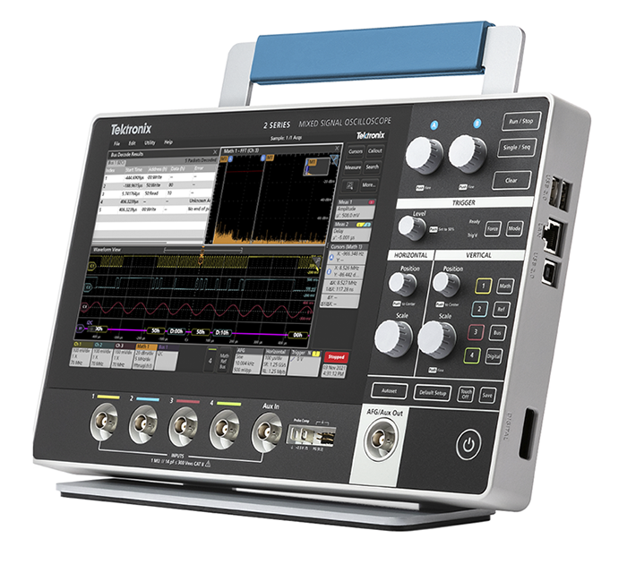

Our laboratory is equipped with a range of experimental and measurement systems for high strain-rate testing, multiaxial deformation studies, vibration measurements, and electronic diagnostics. These facilities support our work in material characterization, wave propagation, inverse modeling, and data-driven constitutive discovery.



## 1. Split-Hopkinson Pressure Bar

The Split Hopkinson Pressure Bar (SHPB), also known as the Kolsky apparatus, is a high strain-rate testing technique used to characterize material behavior under dynamic loading. It consists of two long bars with a short specimen sandwiched between them, where waves are generated using a striker bar.These waves propagate through the incident and transmission bars, while strain gauges record the signals for analysis.The recorded data is used to determine stress, strain, and strain rate, and the system can be adapted for both compression and tension shpb testing.

| Specification | Details |
| :--- | :--- |
| Primary application | High strain-rate material characterization |
| Configurations | Compression SHPB (standard), modifiable to Tension SHPB |
| Bar materials (compression) | Stainless Steel 15-5 PH, Aluminium 7075-T6, Magnesium alloy (for impedance matching) |
| Tension setup | Stainless Steel 15-5 PH bar configuration for tensile pulse generation |
| Striker bar lengths | 100 mm, 200 mm, 300 mm |
| Instrumentation | Strain gauges, signal conditioning unit (Wheatstone bridge / amplifier), and high-speed data acquisition system (oscilloscope) |
| Measured quantities | Incident, reflected, and transmitted waves |
| Strain gauges | 350 Ω, gauge factor 2.07, 3 mm gauge length |
| Amplifier | Transducer amplifier with Wheatstone bridge compatibility and adjustable gain |

## 2. Biaxial Tensile Machine

The biaxial tensile machine is used to deform specimens along two in-plane directions simultaneously. This setup is valuable for probing multiaxial stress states and generating richer experimental data compared to uniaxial testing. It is especially useful for characterizing anisotropic, soft, sheet-like, and nonlinear materials.

| Specification | Details |
| :--- | :--- |
| Primary application | Multiaxial mechanical testing |
| Loading mode | In-plane biaxial tension |
| Measured quantities | Force, displacement, deformation fields |
| Typical use cases | Hyperelastic characterization, anisotropy studies, model calibration |

## 3. Polytec IVS-500 Laser Vibrometer

The Polytec IVS-500 Industrial Vibration Sensor is a non-contact optical instrument used for vibration and velocity measurements. It is particularly useful for wave propagation studies, modal testing, and dynamic response measurements on delicate or lightweight specimens where contact sensors are undesirable.

| Specification | Details |
| :--- | :--- |
| Model | Polytec IVS-500 |
| Measurement type | Non-contact vibration / velocity measurement |
| Maximum frequency | Up to 100 kHz |
| Laser type | Helium Neon (HeNe) |
| Minimum stand-off distance | 47 mm (remote focus) / 86 mm (manual focus) |
| Maximum stand-off distance | 3 m |
| Analog output | ±4 V |
| Protection class | IP64 |
| Weight | ca. 3.1 kg |
| Power supply | 11 V to 14.5 V DC, max. 15 W |

## 4. The Modal Shop Shaker K2004E01

The Modal Shop shaker K2004E01 is used to provide controlled vibration excitation for structural dynamics, modal testing, and wave propagation studies. It is well suited for forced-response experiments and can be used together with optical measurement systems such as laser vibrometers.

| Specification | Details |
| :--- | :--- |
| Kit model | K2004E01 |
| Force rating | 4.5 lbf (20 N) |
| Max frequency | 11 KHz |
| Max stroke | 0.2 in (5 mm) pk-pk |
| Shaker model | 2004E |
| Amplifier model | Integrated |

## 5. Oscilloscope

The oscilloscope is used for time-resolved signal acquisition, debugging, synchronization, and waveform analysis in dynamic experiments. It is especially useful for monitoring sensor outputs, trigger signals, strain gauge responses, excitation signals, and other transient measurements in laboratory testing.

| Specification | Details |
| :--- | :--- |
| Instrument family | Tektronix 2 Series MSO |
| Analog input channels | 2 |
| Maximum sample rate | 2.5 GS/s |
| Record length | 10 M points per channel |
| Vertical resolution | 8 bits |
| Display | 10.1-inch TFT touchscreen |
| Display resolution | 1280 × 800 |
| Digital input channels | 16 (optional / model dependent) |