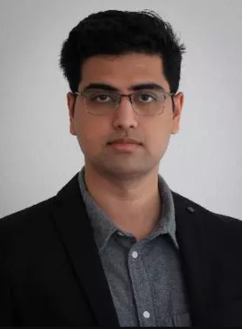

**Title:** Towards Explainable & Interpretable AI for Materials Design

**Speaker:** [Prof. Sid Kumar](https://www.mech-mat.com/home), TU Delft, Netherlands

<!--more-->

### Abstract
Designing materials to meet specific physical property requirements is a time-intensive process, often
marked by resource-heavy experiments and the occasional “Eureka!” moment. Machine learning (ML)
offers potential to streamline the design process, but barriers like data scarcity and the black-box nature of
many models hinder the practical transition from computational predictions to lab synthesis or
manufacturing. Drawing on findings from our recent studies, this talk will explore how incorporating
explainability and interpretability into ML models can leverage prior physics and mechanics knowledge to
accelerate the discovery of new materials. Specifically, I will present how attention-based deep learning
models can facilitate the explainability of structure-property relations in nanoporous polymers, such as
covalent organic frameworks. Likewise, I will demonstrate how interpretable latent space-based deep
learning models can enable automated, yet human-in-the-loop, design of self-healing vitrimeric polymers
with desired properties. Beyond polymers, I will briefly highlight similar applications of explainable and
interpretable ML for designing metamaterials with tailored mechanical properties. These advancements
illustrate how explainable and interpretable ML can accelerate the discovery of novel, sustainable (meta-)materials with desirable properties.


Dr. Sid Kumar is an Assistant Professor at TU Delft in the
Department of Material Science and Engineering and Faculty of
Mechanical Engineering since 2021, where he leads the
Mechanics, Materials, and Computing group. He obtained his
Ph.D. in Aeronautics from Caltech followed by a postdoc position
at ETH Zürich. Previously, he obtained a dual M.S. from Caltech
and Ecole Polytechnique (France). Sid has been awarded the
Dutch Research Council (NWO) Veni award, the Foster and Coco
Stanback fellowship in Engineering and Applied Science at
Caltech, and the University of Paris Saclay fellowship at Ecole
Polytechnique. His research interests lie at the intersection of
mechanics of materials, computational modeling, and machine
learning — with a focus on inverse problems in materials design
and modeling.


