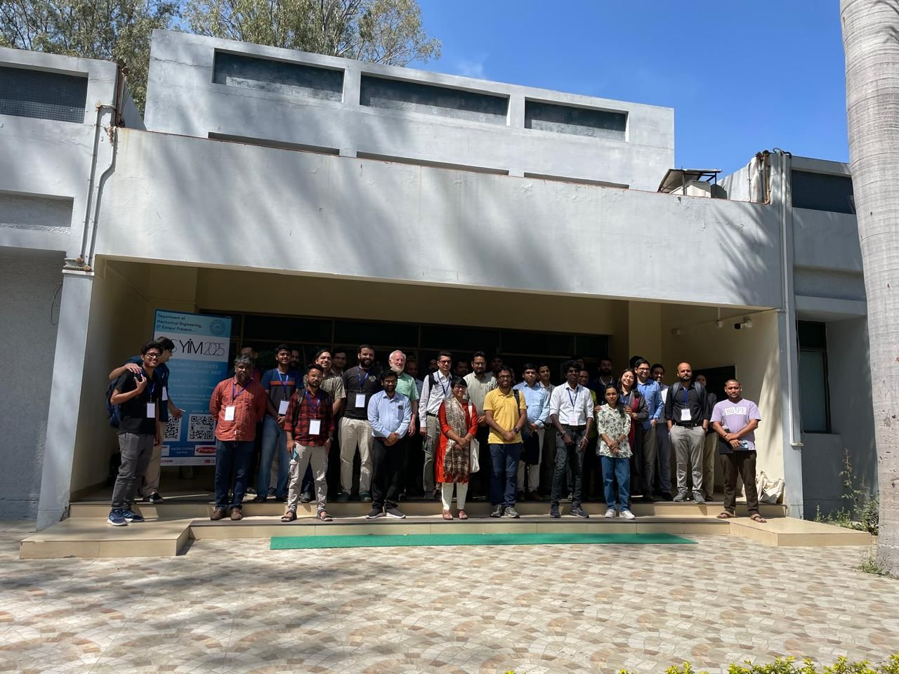

**Title:** Machine Learning Surrogates for Constitutive Modelling of Materials

**Speaker:** [Dr. Akshay Joshi](https://mecheng.iisc.ac.in/people/akshay-joshi/), IISc Bangalore

<!--more-->

{}
**A 3-day summit of talks from academia and industry and open discussions @ IIT Kanpur**

The event aims to bring together early-career researchers working in the field of Mechanical Sciences across India. The event is a first of its kind and should provide a platform to meet, present, discuss, and initiate future collaborations. The topics span solid mechanics, fluid mechanics, heat transfer, robotics, and manufacturing.

https://sites.google.com/view/msyim-2025/

{}

