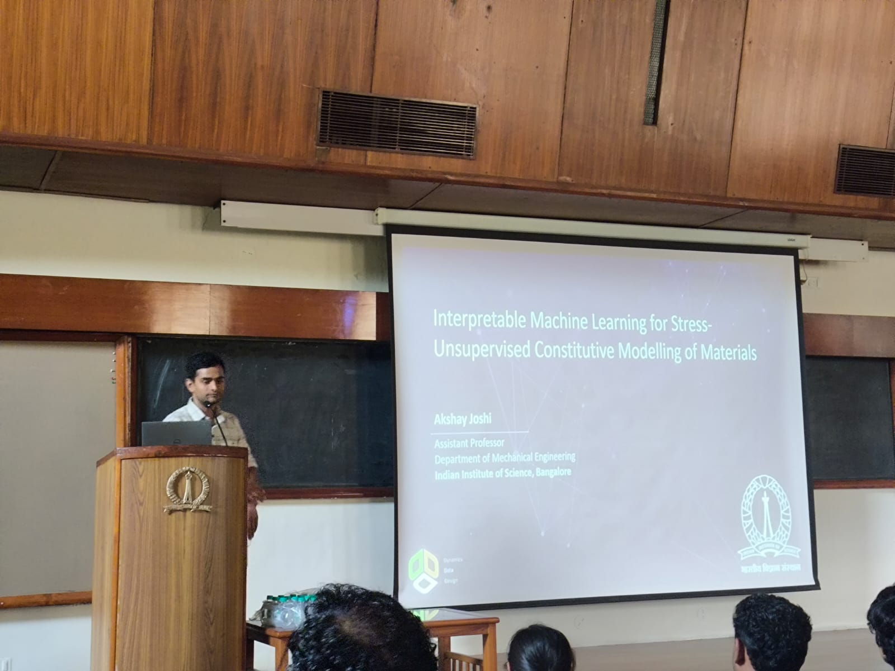
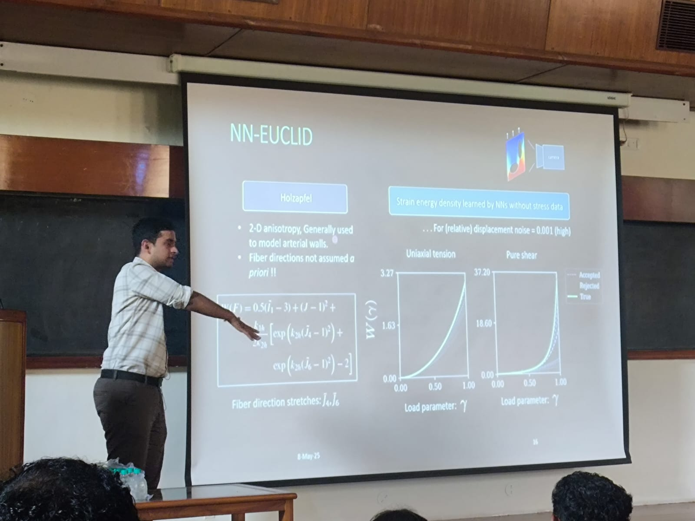

**Theme:** Applications of AI/ML in Engineering

<!--more-->

Mechanical Sciences 3rd Divisional Symposium @ IISc Bangalore to explore Artificial Intelligence and Machine Learning applications in Engineering and foster collaboration between researchers across engineering, data science, and computer science.

**Speaker:** [Dr. Akshay Joshi](https://mecheng.iisc.ac.in/people/akshay-joshi/), IISc Bangalore

**Title:** Interpretable Machine Learning for Stress-Unsupervised Constitutive Modelling of Materials

