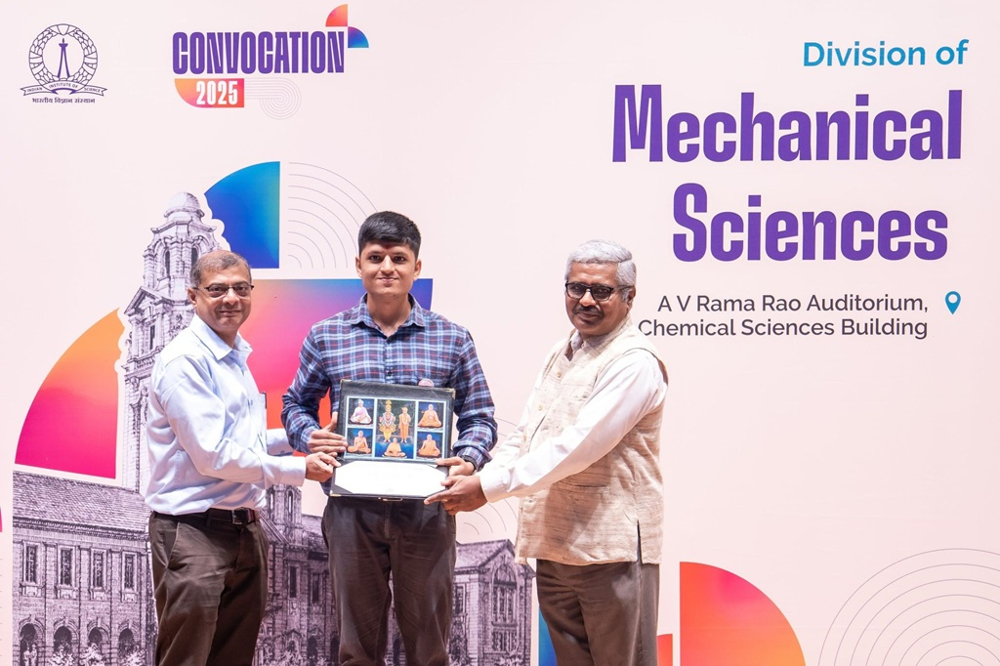
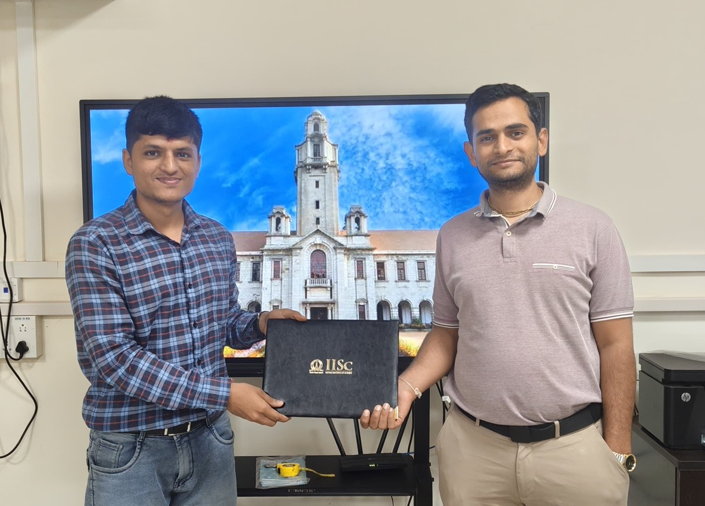

<!--more-->
Indian Institute of Science (IISc) Bangalore held its Convocation-2025 on July 11, 2025 with Professor Manjul Bhargava, Professor of Mathematics at Princeton University as the Chief Guest.

## D3 Lab Students 

| **Name**         | **Degree conferred** |
|------------------|----------------------|
| {}   | MTech    |
| {}    | MTech    |

