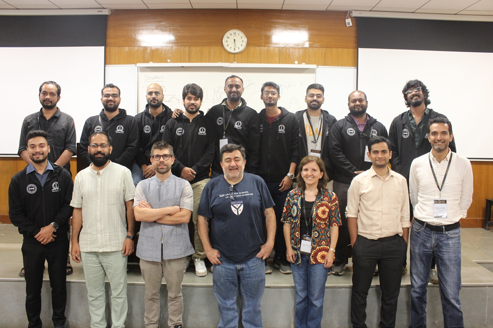
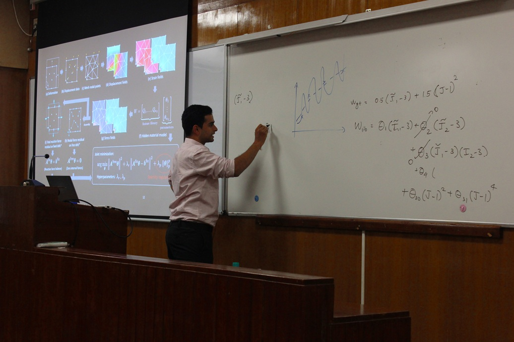
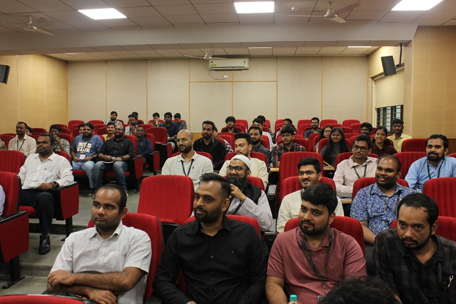
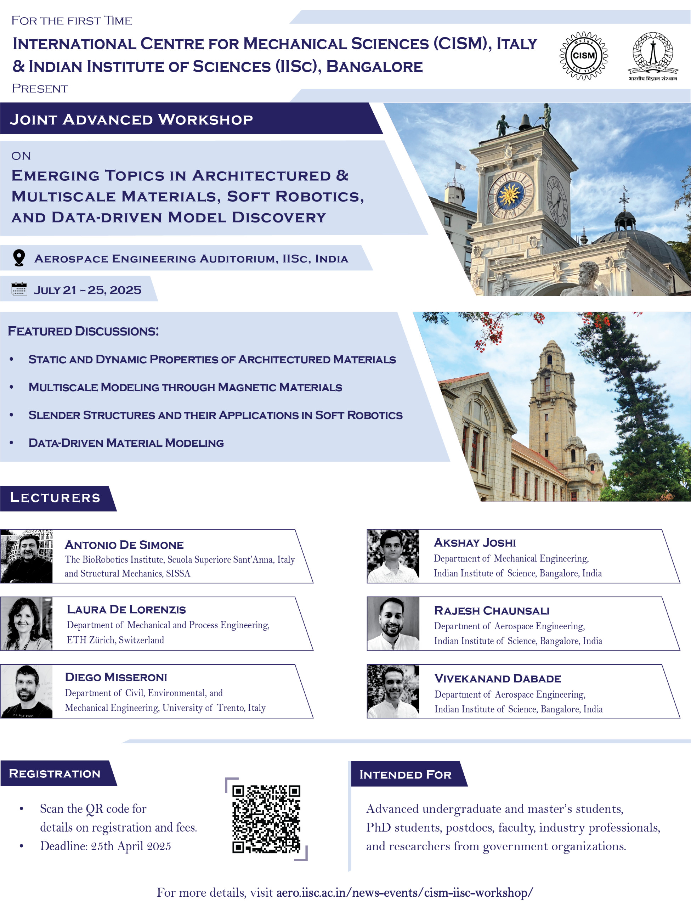

**Title:** Emerging Topics in Architectured & Multiscale Materials, Soft Robotics and Data-Driven Model Discovery

<!--more-->

https://aero.iisc.ac.in/news-events/cism-iisc-workshop/

### Featured Discussions:

- Static and Dynamic Properties of Architectured Materials
- Multiscale Modeling Through Magnetic Materials
- Slender Structures and Their Applications in Soft Robotics
- Data-Driven Material Modeling

**About the Workshop**

The International Centre for Mechanical Sciences (CISM), Italy, and the Indian Institute of Science (IISc), Bangalore, are delighted to announce their first-ever collaboration with the launch of a Joint Advanced Workshop, marking the beginning of what is envisioned to be an annual series of events. The inaugural workshop, titled “Emerging Topics in Architectured & Multiscale Materials, Soft Robotics, and Data-Driven Model Discovery,” held at IISc. This pioneering event convened leading researchers, graduate students, and professionals from across the globe to explore the latest advancements in the topic. Featuring expert-led sessions, interactive discussions, and networking opportunities, the workshop was designed to foster innovation, collaboration, and knowledge exchange, laying a robust foundation for future editions.

