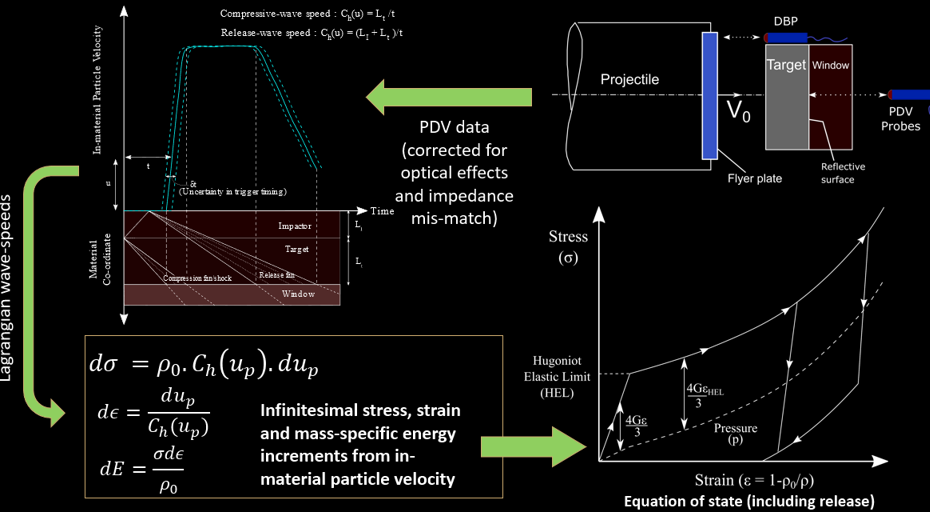
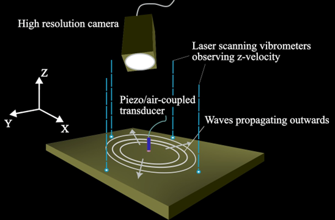
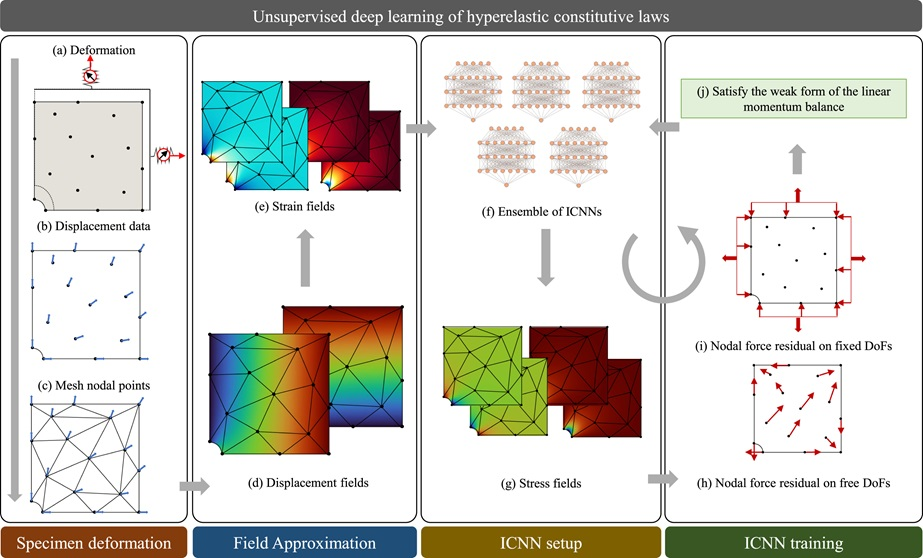
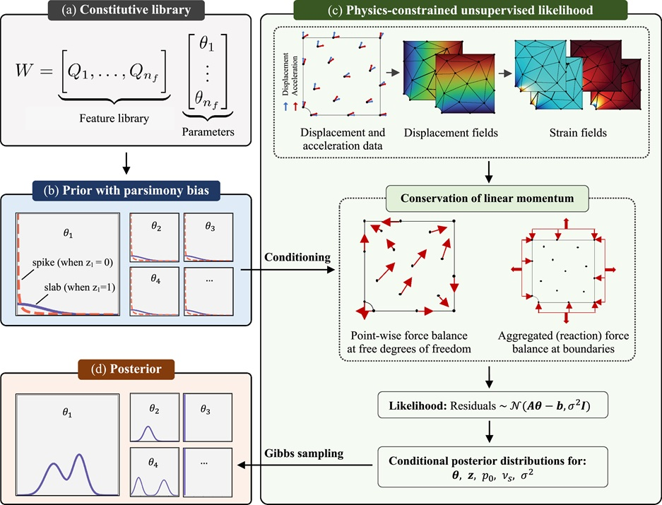

As our group name suggests, we deal with both- the experimental, and machine learning side of things. We attack the problem of characterizing generic material behavior on two fronts - 
1. _designing and conducting better experiments to probe the material behavior efficiently at different stress-states._ 
2. _designing novel machine learning frameworks to learn and surrogate/mimic the material behavior._


```markmap
- D3 Lab
  - Experimentation
    - Plate Impact Studies
    - Split-Hopkinson Pressure Bar (SHPB)
    - Wave propagation
  - ML Frameworks
    - NN EUCLID
    - Bayseian EUCLID
```

## A) Experiments for acquiring data

We work on designing and conducting novel experiments to gather high fidelity data on material behavior. When used alongside adequate data acquisition units, dynamic experiments - plate impact studies, Split-Hopkinson Pressure Bar tests, vibration of thin films, etc. can offer efficient and unique insights into a material's behavior. We seek to make the experiments as efficient/high-throughput as possible - meaning we try to get more material behavior data from a relatively fewer number of experiments.

### A.1) Plate Impact Studies
These experiments involve impacting a high speed flyer plate onto a target material of interest. These are used to study the stress-strain or pressure-volume response of solids subject to pressures of the order of many GPa.


### A.2) Split-Hopkinson Pressure Bar (SHPB)
These tests involve sandwiching a sample of interest between two elastic bars subject to impact at one end. The stress pulse travelling through the bars induce deformation and stress in the sandwiched sample. The stress-strain response of the sample can be recorded by a strain-gauges mounted on the bars.
")

### A.3) Wave propagation in thin plates/films
The surface and flexural waves in the thin specimen are induced by an actuator acting upon the surface. The propagation of these waves and the particle velocities induced by the waves are observed using velocimeters and high-speed cameras. This information is used to characterize the viscoelastic/plastic behavior of the material.



## B) Novel frameworks to learn material behavior

An important pre-requisite for efficient machine learning frameworks used to model material behavior is that they should be stress-unsupervised. That is, they should not rely on full stress-tensors for training as stress-tensors are not available experimentally. Recent trends in data-driven modelling of materials recognize and attempt to address this need. **EUCLID (Efficient Unsupervised Constitutive Law Identification and Discovery)** is one such novel framework that was initially used to characterize hyperelastic materials and has been recently improved and used to characterize other materials. We seek to build on this notion of stress-unsupervised learning to characterize generic and novel materials that exhibit complicated history-dependent behavior. Illustrations of a few developments on the EUCLID paradigm- Bayesian EUCLID and NN-EUCLID is shown below.

### B.1) NN-EUCLID





### B.2) Bayesian-EUCLID






{style="text-align: justify;"}